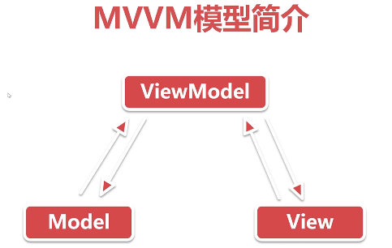
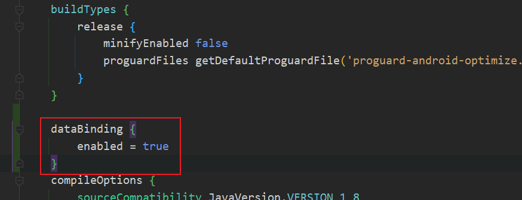
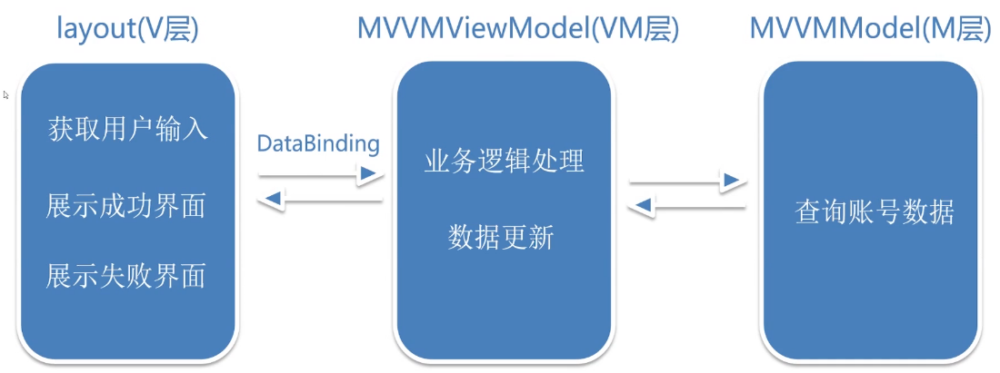

# mvcmvpmvvm
## 简介
> Android大型项目中，为了达到模块内部的高聚合和模块间的低耦合性，提高项目的可维护性和可扩展性，我们通常会使用一种框架模型，这里主要介绍了MVC、MVP、MVVM三种框架模型。对比每个模型的优缺点，结合代码案例来解析每个模型的使用。
## 使用方法
- 查看不使用框架的代码：执行命令切换到该分支：git checkout none_frame_model
- 查看使用MVC框架的代码：执行命令切换到该分支：git checkout mvc_frame_model
- 查看使用MVP框架的代码：执行命令切换到该分支：git checkout mvp_frame_model
- 查看使用MVVM框架的代码：执行命令切换到该分支：git checkout mvvm_frame_model

## MVVM模型介绍

> MVVM是Model-View-ViewModel的简写，MVVM在MVP的基础上实现了数据视图的绑定（DataBinding），当数据变化时，视图会自动更新；反之，当视图发生变化时，数据也会自动更新。
1. 减少了接口数量
2. 告别繁琐findViewById操作

## DataBinding
> DataBinding是Google官方发布的一个实现数据绑定的框架（实现数据与视图的双向绑定），DataBinding可以帮助我们在安卓中更好的实现MVVM模式。

### DataBinding的使用
1. 启动DataBinding
   在app下的build.gradle中引用：
   
2. 修改布局文件为DataBinding布局
3. 绑定数据

## 使用MVVM实现需求

1. 提供View，ViewModel以及Model三层
2. 将布局修改为DataBinding布局
3. View与ViewModel之间通过DataBinding进行通信
4. 获取数据并展示在界面上