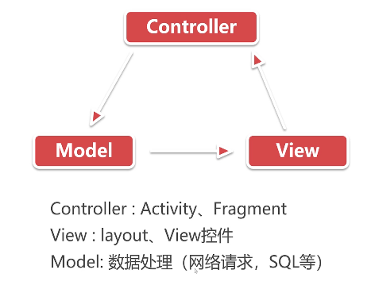
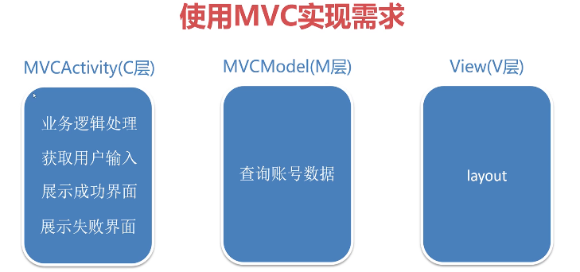

# mvc、mvp、mvvm
## 简介
> Android大型项目中，为了达到模块内部的高聚合和模块间的低耦合性，提高项目的可维护性和可扩展性，我们通常会使用一种框架模型，这里主要介绍了MVC、MVP、MVVM三种框架模型。对比每个模型的优缺点，结合代码案例来解析每个模型的使用。
## 使用方法
- 查看不使用框架的代码：执行命令切换到该分支：git checkout none_frame_model
- 查看使用MVC框架的代码：执行命令切换到该分支：git checkout mvc_frame_model
- 查看使用MVP框架的代码：执行命令切换到该分支：git checkout mvp_frame_model
- 查看使用MVVM框架的代码：执行命令切换到该分支：git checkout mvvm_frame_model
## MVC模型
> MVC的全名是Model View Controller，即模型(model)-视图(view)-控制器(controller)

使用MVC实现案例的示例图：

### 使用MVC实现需求
1. 将数据的获取与界面的展示分离（将查询账号数据从Activity中分离到Model中）
2. 解决各层之间通信问题（Activity通知Model获取数据，Model通知Activity更新界面）