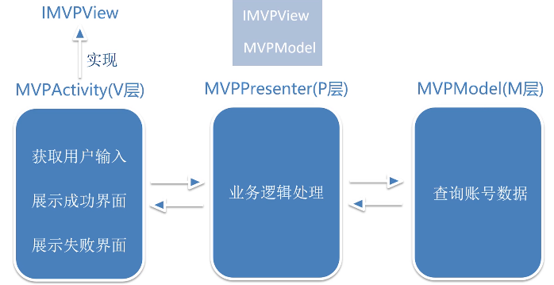

# mvcmvpmvvm
## 简介
> Android大型项目中，为了达到模块内部的高聚合和模块间的低耦合性，提高项目的可维护性和可扩展性，我们通常会使用一种框架模型，这里主要介绍了MVC、MVP、MVVM三种框架模型。对比每个模型的优缺点，结合代码案例来解析每个模型的使用。
## 使用方法
- 查看不使用框架的代码：执行命令切换到该分支：git checkout none_frame_model
- 查看使用MVC框架的代码：执行命令切换到该分支：git checkout mvc_frame_model
- 查看使用MVP框架的代码：执行命令切换到该分支：git checkout mvp_frame_model
- 查看使用MVVM框架的代码：执行命令切换到该分支：git checkout mvvm_frame_model

## MVC与MVP的差别
1. Model与View不再直接进行通信，而是通过中间层Presenter来实现
2. Activity的功能被简化，不再充当控制器，主要负责View层面的工作

## MVP实现需求视图

## MVP实现需求步骤
1. MvpActivity负责提供View层面的功能（采用实现接口的方式）
2. MvpModel负责提供数据方面的功能
3. Model与View不再直接通信，通过Presenter来实现

## MVP的优缺点
优点：解决了MVC中Controller与View过度耦合的缺点，职责划分明显，更加易于维护。
缺点：接口数量多，项目复杂度升高。随着项目复杂度的升高，Presenter层越来越臃肿。